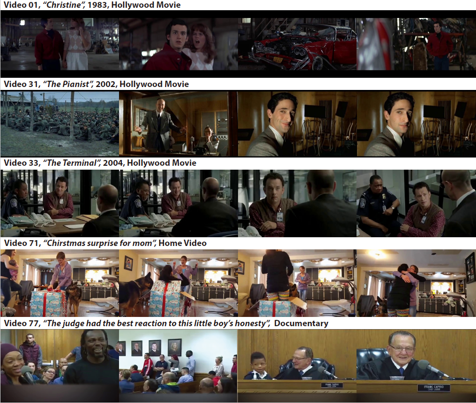

# VEATIC



### [Preprint](https://arxiv.org/abs/2309.06745) | [Project Page](https://veatic.github.io/) 

**VEATIC: Video-based Emotion and Affect Tracking in Context Dataset**<br/>
[Zhihang Ren*](https://albuspeter.github.io/), [Jefferson Ortega*](https://www.jeffersonortega.me/), [Yifan Wang*](https://yfwang.me/), Zhimin Chen,
[David Whitney](https://whitneylab.berkeley.edu/people/dave.html), 
[Yunhui Guo](https://yunhuiguo.github.io/), 
[Stella X. Yu](https://web.eecs.umich.edu/~stellayu/), 
<br/>
\* equal contribution

Human affect recognition has been a significant topic in psychophysics and computer vision. However, the currently published datasets have many limitations. For example, most datasets contain frames that contain only information about facial expressions. Due to the limitations of previous datasets, it is very hard to either understand the mechanisms for affect recognition of humans or generalize well on common cases for computer vision models trained on those datasets. In this work, we introduce a brand new large dataset, the **Video-based Emotion and Affect Tracking in Context Dataset (VEATIC)**, that can conquer the limitations of the previous datasets. VEATIC has **124** video clips from Hollywood movies, documentaries, and home videos with continuous valence and arousal ratings of each frame via real-time annotation. Along with the dataset, we propose a new computer vision task to infer the affect of the selected character via both context and character information in each video frame. Additionally, we propose a simple model to benchmark this new computer vision task. We also compare the performance of the pretrained model using our dataset with other similar datasets. Experiments show the competing results of our pretrained model via VEATIC, indicating the generalizability of VEATIC.

## Set Up

The code can be run under any environment with Python 3.8 and above.
(It may run with lower versions, but we have not tested it).

We recommend using [Conda](https://docs.conda.io/en/latest/) and setting up an environment:

    conda create --name veatic python=3.8

Next, install the required packages:

    pip install -r requirements.txt

We experimented in an Ubuntu environment

## Accessing Dataset

* Downloading [VEATIC Dataset](https://drive.google.com/file/d/1HZIw8RGsRwwENhJlhNJRL88YyfiE442N/view)

After downloading our dataset, you can use `video_frame.py` to convert videos to frames:

    python video_frame.py --path_video $VIDEO_PATH --path_save_video $FRAME_PATH

A dataset is a directory with the following structure:

    dataset
        ├── video
        │   └── ${video_id}.mp4
        ├── rating_averaged
        │   └── ${video_id}.csv
        ├── frame
        │   ├── ${video_id}
        │   └── └── ${frame_id}.png

## Pretrain model

* Downloading [pretrain model](https://drive.google.com/file/d/1dRqmx4UWAtB8E6tcj8XEd16Opk6OZCIx/view?usp=sharing)

This weight was trained and tested on the first 98 videos， the split is 0.7 (first 70% frames for training, last 30% frames for testing) 

## Training
After preparing a dataset, you can train from scratch the by running:

    CUDA_VISIBLE_DEVICES=$GPU_IDS python train.py --epochs $NUM_EPOCHS --batch-size $NUM_BATCH_SIZE --data_path $DATASET_PATH --save $EXPERIMENT_PATH --world-size $NUM_GPUS

If you want to resume the model, you can run:

    CUDA_VISIBLE_DEVICES=$GPU_IDS python train.py --batch-size $NUM_BATCH_SIZE --data_path $DATASET_PATH --save $EXPERIMENT_PATH --weights $WEIGHT_PATH --world-size $NUM_GPUS

The job should use a mutually exclusive set of GPUs. This division allows the
training job to run without having to stop for evaluation.

## Testing
If you want to test the model, you can run:

    CUDA_VISIBLE_DEVICES=0,1,2,3 python train.py --data_path $DATASET_PATH --save $EXPERIMENT_PATH --weights $WEIGHT_PATH --test

 
The job should use a mutually exclusive set of GPUs. This division allows the
training job to run without having to stop for evaluation.

## Citation

If you find the work useful in your research, please consider citing:

```bibtex
@article{ren2023veatic,
   title    = {VEATIC: Video-based Emotion and Affect Tracking in Context Dataset},
   author   = {Ren, Zhihang and Ortega, Jefferson and Wang, Yifan and Chen, Zhimin and Whitney, David and Guo, Yunhui and Yu, Stella X},
   journal  = {arXiv preprint arXiv:2309.06745},
   year     = {2023}
}
```